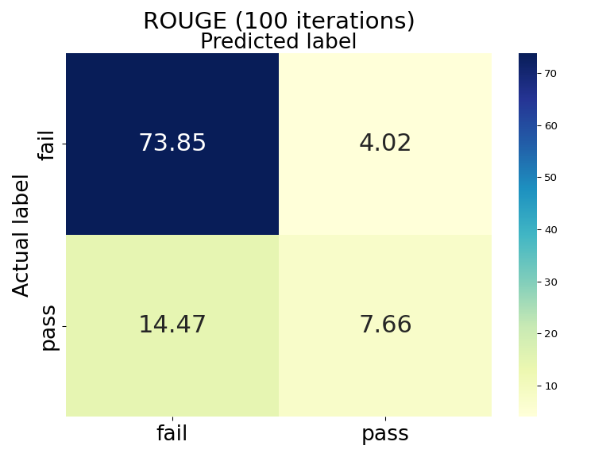
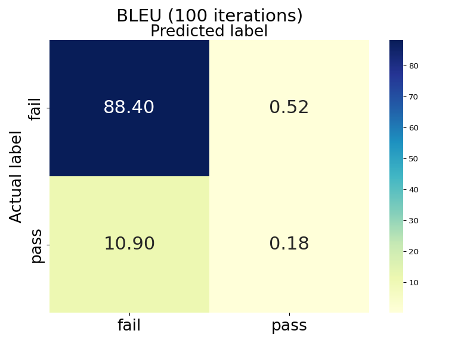
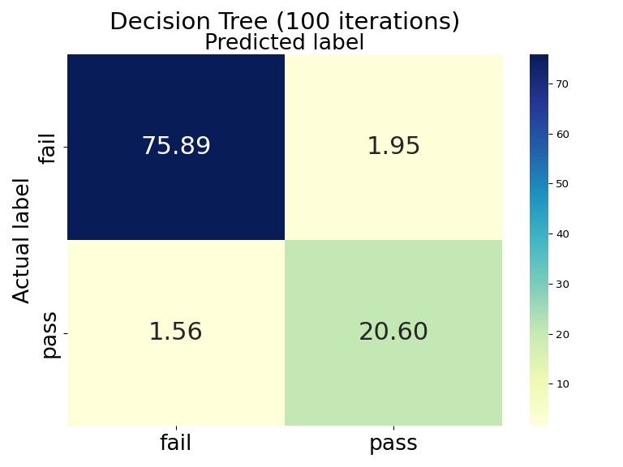
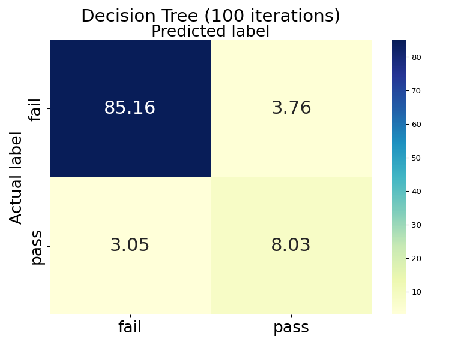

# Metric Test Proxy

Research framework for __code similarity experiments__. This project studies the use of __textual similarity metrics__
(e.g., BLEU, CodeBLEU, ROUGE) as a __test pre-filtering mechanism__ for AI-generated code. The goal is to filter-out 
low-quality code variants — given a _canonical_, human-made implementation — and focus the testing resources on the most
promising code. The experiments were done using the [HumanEval+](https://github.com/evalplus/evalplus/releases/tag/v0.1.0) 
dataset of LLM-generated scripts for numerous Python programming tasks, in addition to human-made implementations 
combined with exhaustive tests meant to assure the correct functionality of the AI code.
___

### Studied Textual Metrics:
- [BLEU](https://github.com/huggingface/evaluate/tree/main/metrics/bleu) (Bilingual Evaluation Understudy)
- [CodeBLEU](https://github.com/k4black/codebleu) (Method for Automatic Evaluation of Code Synthesis)
- [ROUGE](https://github.com/huggingface/evaluate/tree/main/metrics/rouge) (Recall-Oriented Understudy for Gisting Evaluation)
- [METEOR](https://github.com/huggingface/evaluate/tree/main/metrics/meteor) (Metric for Evaluation of Translation with Explicit ORdering)
- [ChrF](https://github.com/huggingface/evaluate/tree/main/metrics/chrf) (Character n-gram F-score for automatic MT evaluation)
- [CrystalBLEU](https://github.com/sola-st/crystalbleu) (Precisely and Efficiently Measuring the Similarity of Code)


## 🚀 Features

- Execute the dataset AI scripts with the HumanEval+ tests.
- Measure the textual similarity between AI scripts and HumanEval+ ground truth implementation.
- Train and evaluate classifiers based on metric score and functional test results.
- CLI interface for easy access to experiments.
- Modular codebase for extending with new metrics or classifiers.

## 📖 Research Context

This project originated as part of an internship study on applying natural-language-inspired similarity metrics — as well
as code-specialized metrics — to AI-generated code evaluation.

- __Motivation__: Reduce computational cost of running exhaustive tests by pre-filtering weak candidates.
- __Protocol__:
  1. Test the AI-generated code.
  2. Measure similarity against reference implementations using textual metrics.
  3. Train classifiers (e.g., logistic regression, decision trees) to predict pass/fail outcomes.
  4. Compare performance across metrics and models.

👉 A detailed __internship report__ is included in [docs/reports/](docs/reports/). <br>
⚠️ Note: The report is not updated with the latest experiments (Decision Tree classifier, CrystalBLEU metric).

___

## 📂 Dataset

The AI-code and the ground truth implementations dataset can be downloaded from the following Zenodo 
[upload](https://zenodo.org/records/17165201). Once downloaded, the zip file must be decompressed in the directory 
__above__ project root.

The experimental results — functional tests, metric scores, classification results — can be downloaded from the following
Zenodo [upload](https://zenodo.org/records/17165437). Similarly to the code dataset, the downloaded zip file must be 
decompressed in the directory __above__ project root.

```
/home/user/
│── metric-test-proxy/           ← project root
│── metric_exp_data/code         ← decompressed dataset
│── metric_exp_data/exp_results  ← decompressed results
```

⚠️ The execution of the first two steps of the protocol on the entire dataset *__may take more than 24 hours__*.
We highly advise to download the experimental results and execute classifiers on the data obtained during the research. <br>
However, the option to re-execute the functional tests and the metrics scores is available for __reproducibility__ purposes.

## 📦 Installation

Clone the repository and install with:
```angular2html
git clone https://github.com/sergiu-mocanu/metric-test-proxy.git
cd metric-test-proxy
pip install -e .
```
We recommend using __conda environment__ or `venv` for isolation.

## 🖥️ Usage
After installation, the CLI is available as:
```angular2html
metric-test --help
```

Examples:
```angular2html
# Measure similarity score of a random AI script
metric-test metric-score-random --metric bleu

# Measure all metric similarity scores of a random AI script and display the test result
metric-test metric-score-random --run-test

# Train and test classifier on metric scores and pass/fail test result
metric-test run-classifier --dataset ai_code --classifier logistic_regression
```
___

## 📊 Results & Observations

⚠️ __Important considerations about the dataset:__

#### 1. High proportion of duplicate scripts
- Due to the generative nature of LLMs, the dataset contains ~49% duplicate code variants.
- Duplicate data may bias classifier training.
- Experiments were therefore conducted with both:
    - the __original dataset__ (2.9M variants), and
    - a __duplicate-free version__ (1.4M variants).
- While duplicate removal mitigates bias, it also reduces training data, which can negatively impact classifier performance.

#### 2. High proportion of faulty scripts
- A majority of generated scripts are faulty (compilation/runtime errors or incorrect functionality).
- In the __original dataset__, ~77.3% of variants are faulty.
- In the __duplicate-free dataset__, this proportion rises to ~87.9%.
- Such imbalance may lead to overly __pessimistic classifiers__ biased toward predicting failure.

Below are some highlights from the experimental study. These results illustrate how textual similarity metrics can be
used to predict functional correctness of AI-generated code variants. <br>

### Logistic Regression
The following confusion matrices illustrate the classification efficiency of the logistic regression classifier (the values are 
represented in %):

 

All the metrics follow the above pattern:
- A non-negligible rate of false positives (~4%)
- The number of false negatives exceeded true positives by ~30–50%

Repeating the experiment with the duplicate-free dataset resulted in a drastic decrease of the classification efficiency:

 

As predicted, training on a dataset with a large proportion of faulty scripts produced a pessimistic classifier. <br><br>
The experiment was repeated with all the metrics combined — with all the combinations of 2 to 6 — in order to establish 
if harnessing the different features would lead to more insight and to better classification results. However, the
results followed a pattern similar to that shown above. <br>
These findings indicate that logistic regression was not effective in establishing the relationship between similarity 
scores and functional correctness.

### Decision Trees
Due to the nature of decision tree classification, the experiment was done with all the metrics combined. The following 
confusion matrices illustrate the classification results (__original__ dataset on the left and __duplicate-free__ version
on the right):

 

The Decision Tree model offers better results in finding a link between similarity score and code correctness. <br>
Training on the original dataset led to promising results, with the false positives and negatives limited to ~1.5%-2%. <br>
Training on the duplicate-free data decreased the classification efficiency: ~3%-3.8% of false positives and negatives. <br>
The drop in performance may stem from overfitting on duplicates or insufficient data after their removal. Further 
research is required.

## 🔮 Future Work

- __Add new code datasets__ (e.g., [Mostly Basic Python Problems](https://github.com/google-research/google-research/tree/master/mbpp)) to broaden evaluation scope.
- __Integrate LLM-based code generation__ to expand dataset diversity.
- __Investigate dataset balancing and augmentation__ to improve classifier performance and robustness.
- __Investigate and prioritize relevant metrics for Decision Tree classifiers__ to reduce computational time.
- __Explore advanced classifiers__ (e.g., Random Forest, XGBoost) for improved predictive performance.

___

## ⚖️ License
This project is licensed under the MIT License.

## 📜 Citation
```bibtex
@misc{mocanu2025metric,
  author = {Sergiu Mocanu},
  title = {Metric Test Proxy: A framework for code similarity experiments},
  year = {2025},
  publisher = {GitHub},
  howpublished = {https://github.com/sergiu-mocanu/metric-test-proxy}
}
```


## Acknowledgments
- __HumanEval__
```bibtex
@article{chen2021codex,
  title={Evaluating Large Language Models Trained on Code},
  author={Mark Chen and Jerry Tworek and Heewoo Jun and Qiming Yuan and Henrique Ponde de Oliveira Pinto and Jared Kaplan and Harri Edwards and Yuri Burda and Nicholas Joseph and Greg Brockman and Alex Ray and Raul Puri and Gretchen Krueger and Michael Petrov and Heidy Khlaaf and Girish Sastry and Pamela Mishkin and Brooke Chan and Scott Gray and Nick Ryder and Mikhail Pavlov and Alethea Power and Lukasz Kaiser and Mohammad Bavarian and Clemens Winter and Philippe Tillet and Felipe Petroski Such and Dave Cummings and Matthias Plappert and Fotios Chantzis and Elizabeth Barnes and Ariel Herbert-Voss and William Hebgen Guss and Alex Nichol and Alex Paino and Nikolas Tezak and Jie Tang and Igor Babuschkin and Suchir Balaji and Shantanu Jain and William Saunders and Christopher Hesse and Andrew N. Carr and Jan Leike and Josh Achiam and Vedant Misra and Evan Morikawa and Alec Radford and Matthew Knight and Miles Brundage and Mira Murati and Katie Mayer and Peter Welinder and Bob McGrew and Dario Amodei and Sam McCandlish and Ilya Sutskever and Wojciech Zaremba},
  year={2021},
  eprint={2107.03374},
  archivePrefix={arXiv},
  primaryClass={cs.LG}
}
```
- __BLEU__
```bibtex
@INPROCEEDINGS{Papineni02bleu:a,
    author = {Kishore Papineni and Salim Roukos and Todd Ward and Wei-jing Zhu},
    title = {BLEU: a Method for Automatic Evaluation of Machine Translation},
    booktitle = {},
    year = {2002},
    pages = {311--318}
}
@inproceedings{lin-och-2004-orange,
    title = "{ORANGE}: a Method for Evaluating Automatic Evaluation Metrics for Machine Translation",
    author = "Lin, Chin-Yew  and
      Och, Franz Josef",
    booktitle = "{COLING} 2004: Proceedings of the 20th International Conference on Computational Linguistics",
    month = "aug 23{--}aug 27",
    year = "2004",
    address = "Geneva, Switzerland",
    publisher = "COLING",
    url = "https://www.aclweb.org/anthology/C04-1072",
    pages = "501--507",
}
```

- __CodeBLEU__
```bibtex
@misc{ren2020codebleu,
      title={CodeBLEU: a Method for Automatic Evaluation of Code Synthesis}, 
      author={Shuo Ren and Daya Guo and Shuai Lu and Long Zhou and Shujie Liu and Duyu Tang and Neel Sundaresan and Ming Zhou and Ambrosio Blanco and Shuai Ma},
      year={2020},
      eprint={2009.10297},
      archivePrefix={arXiv},
      primaryClass={cs.SE}
}
```

- __ROUGE__
```bibtex
@inproceedings{lin-2004-rouge,
    title = "{ROUGE}: A Package for Automatic Evaluation of Summaries",
    author = "Lin, Chin-Yew",
    booktitle = "Text Summarization Branches Out",
    month = jul,
    year = "2004",
    address = "Barcelona, Spain",
    publisher = "Association for Computational Linguistics",
    url = "https://www.aclweb.org/anthology/W04-1013",
    pages = "74--81",
}
```

- __METEOR__
```bibtex
@inproceedings{banarjee2005,
  title     = {{METEOR}: An Automatic Metric for {MT} Evaluation with Improved Correlation with Human Judgments},
  author    = {Banerjee, Satanjeev  and Lavie, Alon},
  booktitle = {Proceedings of the {ACL} Workshop on Intrinsic and Extrinsic Evaluation Measures for Machine Translation and/or Summarization},
  month     = jun,
  year      = {2005},
  address   = {Ann Arbor, Michigan},
  publisher = {Association for Computational Linguistics},
  url       = {https://www.aclweb.org/anthology/W05-0909},
  pages     = {65--72},
}
```

- __ChrF__
```bibtex
@inproceedings{popovic-2015-chrf,
    title = "chr{F}: character n-gram {F}-score for automatic {MT} evaluation",
    author = "Popovi{\'c}, Maja",
    booktitle = "Proceedings of the Tenth Workshop on Statistical Machine Translation",
    month = sep,
    year = "2015",
    address = "Lisbon, Portugal",
    publisher = "Association for Computational Linguistics",
    url = "https://aclanthology.org/W15-3049",
    doi = "10.18653/v1/W15-3049",
    pages = "392--395",
}
@inproceedings{popovic-2017-chrf,
    title = "chr{F}++: words helping character n-grams",
    author = "Popovi{\'c}, Maja",
    booktitle = "Proceedings of the Second Conference on Machine Translation",
    month = sep,
    year = "2017",
    address = "Copenhagen, Denmark",
    publisher = "Association for Computational Linguistics",
    url = "https://aclanthology.org/W17-4770",
    doi = "10.18653/v1/W17-4770",
    pages = "612--618",
}
@inproceedings{post-2018-call,
    title = "A Call for Clarity in Reporting {BLEU} Scores",
    author = "Post, Matt",
    booktitle = "Proceedings of the Third Conference on Machine Translation: Research Papers",
    month = oct,
    year = "2018",
    address = "Belgium, Brussels",
    publisher = "Association for Computational Linguistics",
    url = "https://www.aclweb.org/anthology/W18-6319",
    pages = "186--191",
}
```